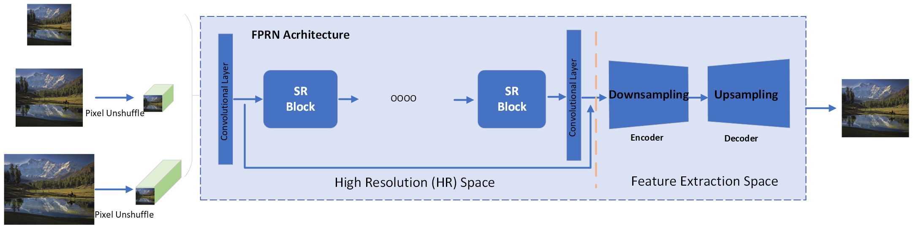

<p align="center">
  
</p>


<div align="center">

  ⚡[**Usage**](#-quick-inference) **|** 🏰[**Model Zoo**](docs/model_zoo.md) **|** 🔧[Install](#-dependencies-and-installation)  **|** 💻[Train](docs/Training.md) **|** 🎨[Contribution](docs/CONTRIBUTING.md)


</div>


<!-- 1. You can try in our website: [ARC Demo](https://arc.tencent.com/en/ai-demos/imgRestore) (now only support RealESRGAN_x4plus_anime_6B) -->
1. :boom: Online Colab demo for FPRN: [](https://colab.research.google.com/drive/1k2Zod6kSHEvraybHl50Lys0LerhyTMCo?usp=sharing)
<!-- 1. You can watch enhanced animations in [Tencent Video](https://v.qq.com/s/topic/v_child/render/fC4iyCAM.html). 欢迎观看[腾讯视频动漫修复](https://v.qq.com/s/topic/v_child/render/fC4iyCAM.html) -->

FPRN aims at developing **Image Restoration Algorithm for Online Image Resoration in real-time to Defend Against the Black-box Attack**.<br>
This developed FPRN is trained with pure synthetic data. Since CNN can not infer the object label or localize the position in attacked image. This algorithm can be used to preprocess the black-box attacked image to improve inference confidence. Based on our test, the proposed FPRN can adapt to different image attack algorithm.

🌌 Thanks for your feedbacks/suggestions.


If FPRN is helpful, please help to ⭐ this repo or recommend it to your friends 😊 <br>


## Dependencies and Installation

- Python >= 3.7 (Recommend to use [Anaconda](https://www.anaconda.com/download/#linux) or [Miniconda](https://docs.conda.io/en/latest/miniconda.html))
- [PyTorch >= 1.7](https://pytorch.org/)

### Installation

1. Clone repo

    ```bash
    git clone git@github.com:haotiangu/FPRN.git
    cd FPRN
    ```

1. Install dependent packages

    ```bash
    # Install basicsr - https://github.com/xinntao/BasicSR
    # We use BasicSR for both training and inference
    pip install basicsr
    # facexlib and gfpgan are for face enhancement
    pip install facexlib
    pip install gfpgan
    pip install -r requirements.txt
    python setup.py develop
    ```


## ⚡ Quick Inference

There are usually three ways to inference FPRN.
1. [Online inference](#offline-attacked-image-restoration)
1. [Python script](#python-script)

### Offline Attacked Image Restoration

1. [Colab Demo](https://colab.research.google.com/drive/1k2Zod6kSHEvraybHl50Lys0LerhyTMCo?usp=sharing) for FPRN.


### Python script

#### Usage of python script

1. You can use X4 model for **arbitrary output size** with the argument `outscale`. The program will further perform cheap resize operation after the FPRN output.

```console
Usage: python inference_FPRN.py -n FPRN_x4plus -i infile -o outfile [options]...

A common command: python inference_FPRN.py -n FPRN_x4plus -i infile --outscale 3.5 --face_enhance

  -h                   show this help
  -i --input           Input image or folder. Default: inputs
  -o --output          Output folder. Default: results
  -n --model_name      Model name. Default: FPRN_x4plus
  -s, --outscale       The final upsampling scale of the image. Default: 4
  --suffix             Suffix of the restored image. Default: out
  -t, --tile           Tile size, 0 for no tile during testing. Default: 0
  --face_enhance       Whether to use GFPGAN to enhance face. Default: False
  --fp32               Use fp32 precision during inference. Default: fp16 (half precision).
  --ext                Image extension. Options: auto | jpg | png, auto means using the same extension as inputs. Default: auto
```

#### Inference general images

Download pre-trained models: [FPRN_x4plus.pth](https://github.com/haotiangu/FPRN/releases/download/FPRN/FPRN_x4plus.pth)

```bash
wget https://github.com/haotiangu/FPRN/releases/download/FPRN/FPRN_x4plus.pth -P weights
```

Inference!

```bash
python inference_FPRN.py -n FPRN_x4plus -i inputs --face_enhance
```

Results are in the `results` folder


## Contact

If you have any question, please email `hgu8@stevens.edu`.

<!---------------------------------- Projects that use Real-ESRGAN --------------------------->
## Projects that use FPRN

If you encounter any problem when developing FPRN as real time attack defense in your projects, Please feel free to let me know.

